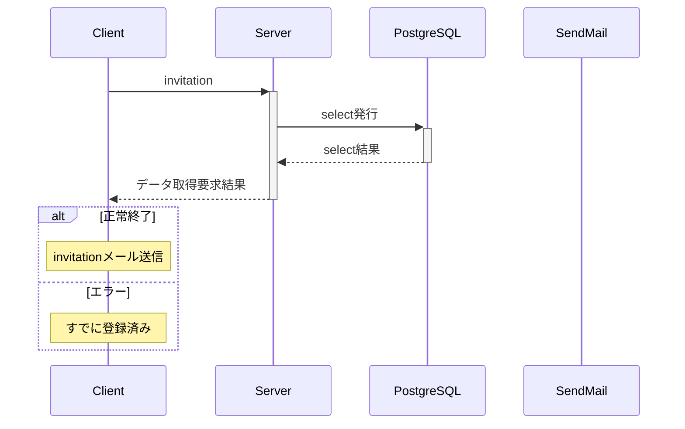

# This source is here.

<https://gill.net.in/posts/auth-microservice-rust-actix-web1.0-diesel-complete-tutorial/>

```mermaid
sequenceDiagram
    # エイリアス
    participant cl as Client
    participant sv as Server
    participant db as PostgreSQL
    participant ms as SendMail

    # invitation handler APIシーケンス
    cl ->>+ sv : invitation
    sv ->>+ db : select発行
    db -->>- sv : select結果
    sv -->>- cl : データ取得要求結果

    alt 正常終了
        Note over cl : invitationメール送信
    else エラー
        Note over cl : すでに登録済み
    end
```

## TODO: 
